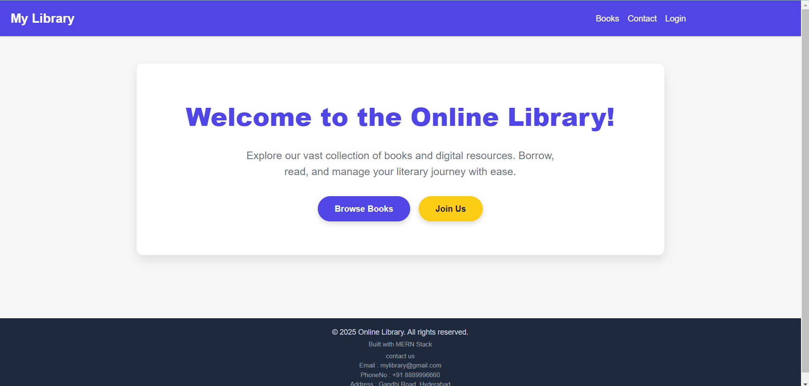
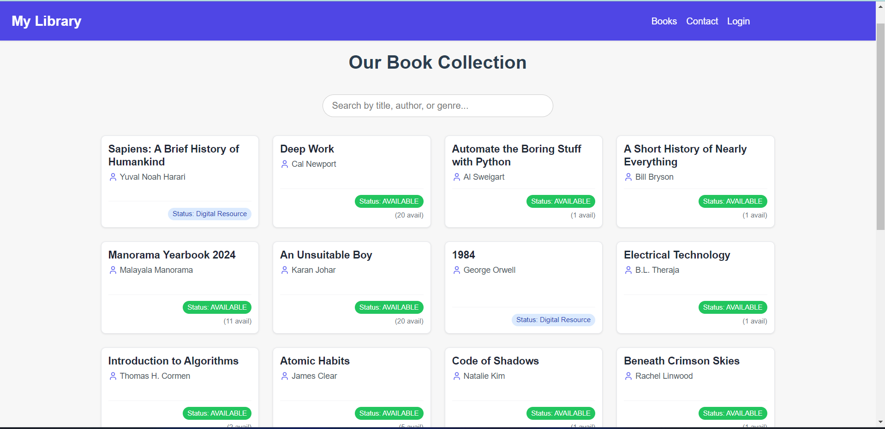
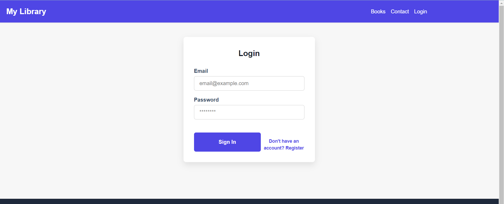
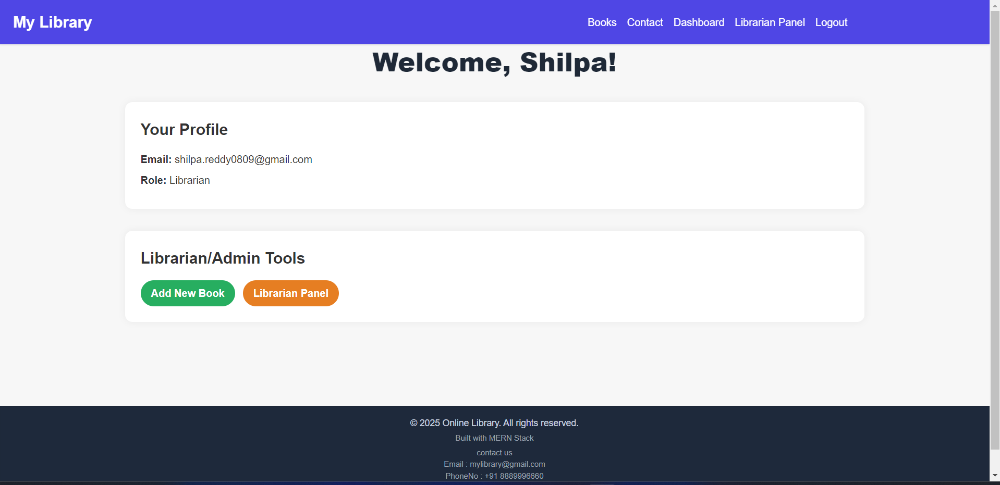
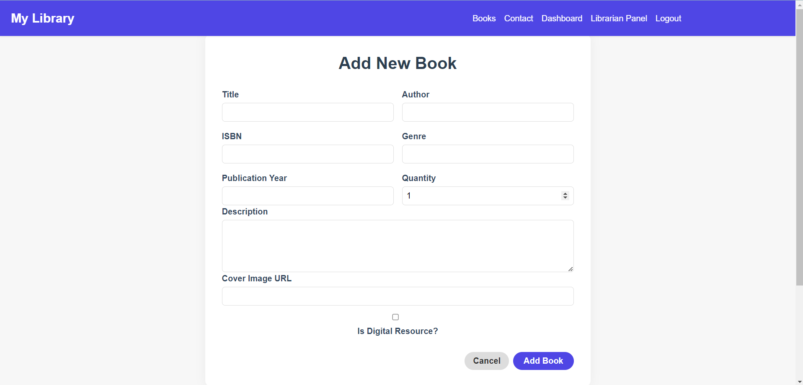
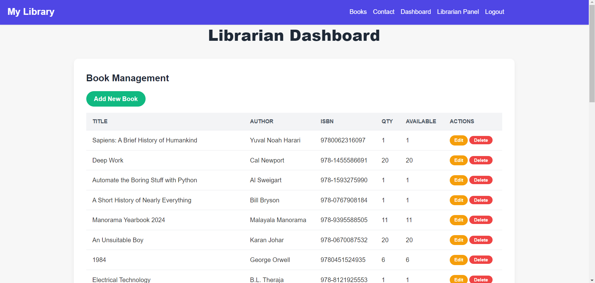
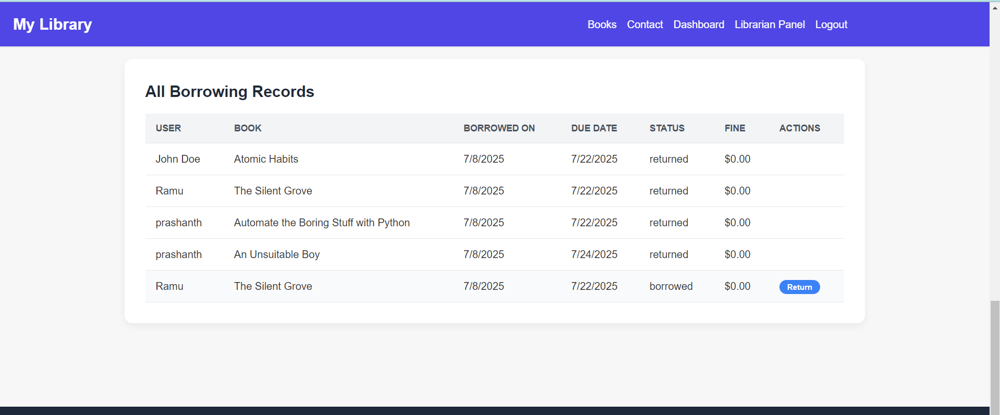
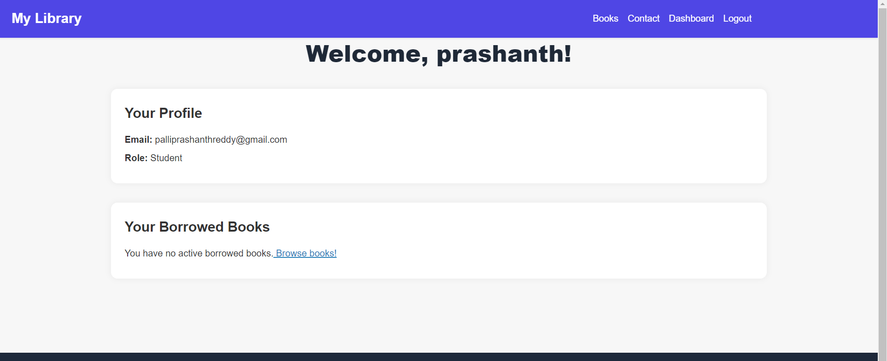
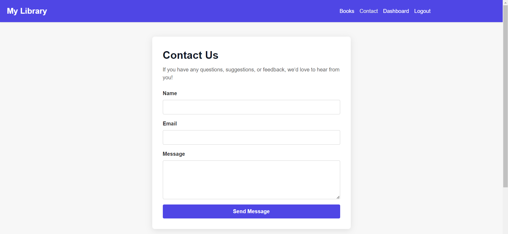

# 📚 MERN Library Management System

This is a full-stack **Library Management System** built using the **MERN stack** (MongoDB, Express.js, React.js, Node.js). It supports **Admin** and **Student** roles with features like book management, digital resource access, issue tracking, and more.

---

## 🚀 Features

### 👩‍🏫 Admin
- Admin login/logout
- Add/edit/delete books
- View and manage book inventory
- Access digital resource links
- Issue/return tracking

### 👨‍🎓 Student
- Register/login as a student
- View books with search and filter
- Read book descriptions and availability
- Access digital books (if enabled)

---

## 🛠️ Tech Stack

| Layer       | Technology                     |
|-------------|--------------------------------|
| Frontend    | React, Vite, Tailwind CSS      |
| Backend     | Node.js, Express.js            |
| Database    | MongoDB Atlas, Mongoose        |
| Auth        | JWT (JSON Web Tokens)          |
| Styling     | Tailwind CSS (fully responsive)|

---
##refer/screenshots

## 📸 Screenshots

### Home Page


### books Page


### Login Page


### Admin profile


### add Book


### Admin Dashboard


### Admin Dashboard-2


### user panel


### contact



## 📁 Project Structure
📦 library-management-system-mern/
├── backend/
│ ├── controllers/
│ ├── models/
│ ├── routes/
│ ├── middleware/
│ ├── .env
│ └── server.js
├── frontend/
│ ├── src/
│ ├── public/
│ ├── .env
│ └── vite.config.js
├── README.md
├── LICENSE
└── .env.example


---

## ⚙️ Installation Instructions

### 1. Clone the Repository
```bash
git clone https://github.com/your-username/library-management-system-mern.git
cd library-management-system-mern


##Backend Setup
cd backend
npm install
# Create .env (refer .env.example)
npm run dev

##Frontend Setup
cd ../frontend
npm install
npm run dev


📄 License
This project is licensed under the MIT License.
See the LICENSE file for more details.